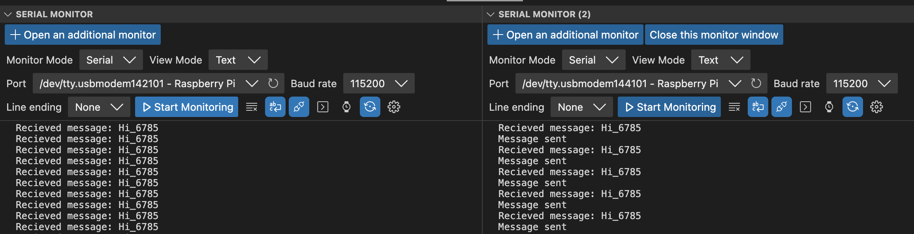

[](https://github.com/uofu-emb/2024-Lab08-Todd-Logan/actions/workflows/main.yml)

# Lab 8 Networking

## Activity
This activity will establish sending and receiving messages. You can use this template, modified from the API docs.

```
#include <can2040.h>
#include <hardware/regs/intctrl.h>
#include <stdio.h>
#include <pico/stdlib.h>

static struct can2040 cbus;

static void can2040_cb(struct can2040 *cd, uint32_t notify, struct can2040_msg *msg)
{
    // Put your code here....
}

static void PIOx_IRQHandler(void)
{
    can2040_pio_irq_handler(&cbus);
}

void canbus_setup(void)
{
    uint32_t pio_num = 0;
    uint32_t sys_clock = 125000000, bitrate = 500000;
    uint32_t gpio_rx = 4, gpio_tx = 5;

    // Setup canbus
    can2040_setup(&cbus, pio_num);
    can2040_callback_config(&cbus, can2040_cb);

    // Enable irqs
    irq_set_exclusive_handler(PIO0_IRQ_0, PIOx_IRQHandler);
    irq_set_priority(PIO0_IRQ_0, PICO_DEFAULT_IRQ_PRIORITY - 1);
    irq_set_enabled(PIO0_IRQ_0, 1);

    // Start canbus
    can2040_start(&cbus, sys_clock, bitrate, gpio_rx, gpio_tx);
}
```

1. Wire up CAN transceiver to your boards. In the example code RX/TX is on GPIO 4/5 - any GPIO is valid.
1. On one board, create a function that sends a message periodically using `can2040_transmit`
1. On another board, register a callback with `can_callback_config` to receive and log the messages.
1. Verify that the two are communicating.

1. Observe the electrical behavior of the bus line and the microcontroller lines.


## Activity
This activity will observe bus contention from a babbling node. "In a Controller Area Network a babbling node is a node continuously (and usually erroneously) transmitting CAN frames with identical - often high - priority."

1. Combine the send and receive code together, so each microcontroller does both.
1. On one board, broadcast messages with a high priority continuously.
1. On the other board, broadcast a message with a lower priority periodically.
1. Use oscilloscope to observe the access pattern.
1. Observe how often the lower priority message is actually transmitted and received.
1. Introduce a short busy wait delay into the babbling node, slowly increase the duration until you observe the other messages consistently received.
1. Document your observations in your repository.


1. Document your observations in your repository.


1. Document your observations in your repository.


